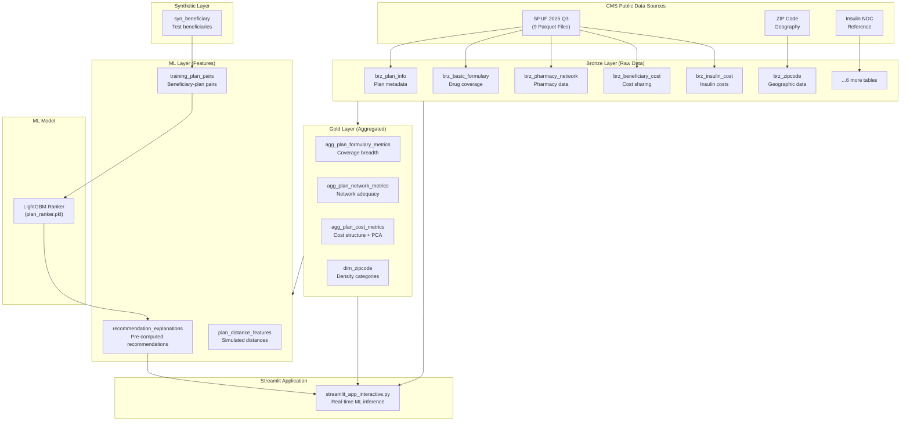
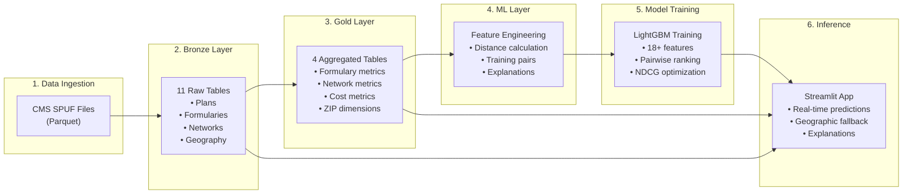

# Medicare Part D Prescription Plan Recommendation System

A comprehensive, intelligent Medicare Part D plan recommendation system that uses **machine learning**, **geospatial analysis**, and **CMS public data** to help Medicare beneficiaries find the most suitable prescription drug plans based on their medications, location, and individual needs.

---

## 📑 Table of Contents

- [Overview](#-overview)
- [Key Features](#-key-features)
- [System Architecture](#-system-architecture)
  - [High-Level Architecture](#high-level-architecture)
  - [Data Pipeline Layers](#data-pipeline-layers)
  - [Complete Data Flow](#complete-data-flow)
- [Database Schema](#-database-schema)
  - [Bronze Layer (Raw Data)](#bronze-layer-raw-data)
  - [Gold Layer (Aggregated Metrics)](#gold-layer-aggregated-metrics)
  - [ML Layer (Features)](#ml-layer-features)
  - [Synthetic Layer (Test Data)](#synthetic-layer-test-data)
- [ML Pipeline Workflow](#-ml-pipeline-workflow)
  - [How the ML Pipeline Works](#how-the-ml-pipeline-works)
  - [Feature Engineering Process](#feature-engineering-process)
  - [Model Training & Outputs](#model-training--outputs)
- [Installation & Setup](#-installation--setup)
  - [Prerequisites](#prerequisites)
  - [Step-by-Step Installation](#step-by-step-installation)
  - [Pipeline Execution](#pipeline-execution)
- [Running the Application](#-running-the-application)
  - [Streamlit Interactive App](#streamlit-interactive-app)
  - [Application Features](#application-features)
- [Programmatic Usage](#-programmatic-usage)
  - [Database Queries](#database-queries)
  - [Direct DuckDB Access](#direct-duckdb-access)
- [Medicare Part D Concepts](#-medicare-part-d-concepts)
- [Performance Metrics](#-performance-metrics)
- [Project Structure](#-project-structure)
- [Troubleshooting](#-troubleshooting)
- [Technology Stack](#-technology-stack)
- [Future Enhancements](#-future-enhancements)
- [References](#-references)
- [License & Disclaimer](#%EF%B8%8F-license--disclaimer)

---

## 🎯 Overview

This system provides **intelligent, personalized Medicare Part D plan recommendations** for beneficiaries by:

1. **Processing CMS Public Data**: Ingests Medicare plan information, formularies, costs, and pharmacy networks from CMS SPUF (Standard Part D PUF) 2025 Q3 data
2. **Building a Multi-Layer Database**: Creates Bronze (raw), Gold (aggregated), and ML (features) layers in DuckDB for high-performance analytics
3. **Engineering Geospatial Features**: Calculates county-level service areas and distance to nearest preferred pharmacies
4. **Training ML Ranking Models**: Uses LightGBM to rank plans based on cost, coverage, network adequacy, and pharmacy access
5. **Generating Recommendations**: Provides top plan recommendations with human-readable explanations of trade-offs

**Target Users**: Medicare beneficiaries (especially insulin users), insurance agents, researchers, policy analysts

**Primary Focus**: County-level plan recommendations with special handling for the IRA $35 insulin cap

---

## ✨ Key Features

### Core Capabilities

- **🗺️ Geographic Intelligence**: County-level service area filtering with automatic fallback to nearby counties when no plans available
- **💉 Insulin $35 Cap Tracking**: Special cost handling for insulin products under the Inflation Reduction Act
- **🤖 ML-Powered Ranking**: LightGBM model trained on 18+ features to rank plans by total cost and suitability
- **📍 Pharmacy Access Analysis**: Distance calculations to nearest preferred pharmacy based on population density and network data
- **⚖️ Trade-off Visualization**: Clear explanations of cost vs. distance trade-offs (e.g., "save $500/year but drive 12 miles further")
- **🔍 Real-Time Inference**: Interactive Streamlit app with live ML predictions and geographic fallback

### Advanced Analytics

- **PCA-Based Affordability Index**: Data-driven affordability scoring using Principal Component Analysis on 8 cost factors
- **Formulary Restrictiveness Scoring**: Quantile-based classification (Low/Medium/High) of prior authorization, step therapy, and quantity limits
- **Network Adequacy Assessment**: Flags plans with limited pharmacy networks (<10 preferred pharmacies)
- **County-Level Constraints**: Respects MA-PD county boundaries and PDP regional service areas

---

## 🏗️ System Architecture

### High-Level Architecture



### Data Pipeline Layers

The system uses a **medallion architecture** with four distinct layers:

| Layer | Purpose | Tables | Data Quality | Update Frequency |
|-------|---------|--------|--------------|------------------|
| **Bronze** | Raw ingested data from CMS | 11 tables | As-is from source | On SPUF release (~quarterly) |
| **Gold** | Business-level aggregations | 4 tables | Validated, enriched | After Bronze update |
| **ML** | Features for model training | 3 tables | Derived, engineered | After Gold + Synthetic update |
| **Synthetic** | Test/demo beneficiaries | 1 table | Simulated | As needed |

### Complete Data Flow



---

## 📊 Database Schema

**Database**: `data/medicare_part_d.duckdb` (DuckDB 0.10+)

### Bronze Layer (Raw Data)

11 tables containing raw CMS data with minimal transformations:

| Table | Rows | Purpose | Key Columns |
|-------|------|---------|-------------|
| `bronze.brz_plan_info` | ~4,600 | Plan metadata, premiums, deductibles | `PLAN_KEY`, `FORMULARY_ID`, `PREMIUM`, `DEDUCTIBLE`, `IS_MA_PD`, `IS_PDP` |
| `bronze.brz_basic_formulary` | ~3.5M | Drug coverage by formulary | `FORMULARY_ID`, `NDC`, `TIER_LEVEL_VALUE`, restrictions |
| `bronze.brz_pharmacy_network` | ~2.8M | Pharmacy networks per plan | `PLAN_KEY`, `PHARMACY_NUMBER`, `IS_PREFERRED_RETAIL` |
| `bronze.brz_beneficiary_cost` | ~350K | Cost-sharing by tier/phase | `PLAN_KEY`, `TIER`, `COVERAGE_LEVEL`, copay/coinsurance |
| `bronze.brz_insulin_cost` | ~25K | Insulin-specific costs (IRA cap) | `PLAN_KEY`, `copay_amt_pref_insln` |
| `bronze.brz_excluded_drugs` | ~180K | Explicitly excluded drugs | `PLAN_KEY`, `RXCUI` |
| `bronze.brz_geographic` | ~3,200 | County-to-region mapping | `COUNTY_CODE`, `STATE`, `PDP_REGION_CODE` |
| `bronze.brz_zipcode` | ~29K | ZIP code geography | `zip_code`, `lat`, `lng`, `density`, `population` |
| `bronze.brz_insulin_ref` | 84 | Insulin NDC reference | `ndc`, `is_insulin` |
| `bronze.brz_pricing` | ~15K | Drug pricing data | `PLAN_KEY`, pricing details |
| `bronze.brz_ibc` | ~350K | Indication-based coverage | `PLAN_KEY`, coverage rules |

### Gold Layer (Aggregated Metrics)

4 tables with plan-level aggregations and enrichments:

| Table | Purpose | Key Metrics |
|-------|---------|-------------|
| `gold.agg_plan_formulary_metrics` | Formulary breadth and restrictiveness | `formulary_breadth_pct`, `generic_tier_pct`, `specialty_tier_pct`, `pa_rate`, `st_rate`, `ql_rate`, `restrictiveness_class` (0-2), `insulin_coverage_pct` |
| `gold.agg_plan_network_metrics` | Pharmacy network adequacy | `total_pharmacies`, `preferred_pharmacies`, `pref_pharmacy_pct`, `network_adequacy_flag` (1 if <10 preferred) |
| `gold.agg_plan_cost_metrics` | Cost structure + PCA affordability | `pref_avg_copay_amt`, `pref_median_copay_amt`, tier-level costs, `affordability_index` (PCA), `affordability_class` (0-3 quartiles) |
| `gold.dim_zipcode` | ZIP code dimension | `zip_code`, `density_category` (URBAN/SUBURBAN/RURAL), `lat`, `lng` |

### ML Layer (Features)

3 tables for model training and recommendations:

| Table | Rows | Purpose | Key Columns |
|-------|------|---------|-------------|
| `ml.plan_distance_features` | ~15K | Simulated distance to pharmacy by plan-county | `PLAN_KEY`, `COUNTY_CODE`, `simulated_distance_miles`, `distance_category`, network metrics |
| `ml.training_plan_pairs` | ~500K | Beneficiary-plan pairs with features | All 18+ features: plan, beneficiary, formulary, network, distance, cost |
| `ml.recommendation_explanations` | ~50K | Top 5 recommendations per beneficiary | `bene_synth_id`, `PLAN_KEY`, `recommendation_rank`, cost/distance explanations, warnings |

### Synthetic Layer (Test Data)

| Table | Rows | Purpose |
|-------|------|---------|
| `synthetic.syn_beneficiary` | 10,000 | Test beneficiary profiles | `bene_synth_id`, location, `unique_drugs`, `insulin_user_flag`, `risk_segment` |

---

## 🤖 ML Pipeline Workflow

### How the ML Pipeline Works

The ML pipeline transforms raw CMS data into personalized plan recommendations through a series of automated steps:

```mermaid
flowchart TD
    Start["Start: Raw CMS Data<br/>in Bronze Layer"] --> Step1
    
    Step1["Step 1: Gold Aggregations<br/>db/gold/*.py"] --> Step1Out["Output:<br/>• Formulary metrics per plan<br/>• Network metrics per plan<br/>• Cost structure per plan<br/>• Affordability index (PCA)"]
    
    Step1Out --> Step2["Step 2: Generate Synthetic Beneficiaries<br/>scripts/generate_beneficiary_profiles.py"]
    
    Step2 --> Step2Out["Output:<br/>• 10,000 beneficiaries<br/>• County assignments<br/>• Drug utilization profiles<br/>• 15% insulin users"]
    
    Step2Out --> Step3["Step 3: Assign ZIP Codes<br/>db/ml/02_assign_geography.py"]
    
    Step3 --> Step3Out["Output:<br/>• ZIP codes assigned (population-weighted)<br/>• Lat/lng coordinates<br/>• Population density"]
    
    Step3Out --> Step4["Step 4: Calculate Distances<br/>db/ml/03_calculate_distance.py"]
    
    Step4 --> Step4Out["Output (ml.plan_distance_features):<br/>• Simulated distance to pharmacy<br/>• Based on density + network size<br/>• Categories: very_close/nearby/moderate/far"]
    
    Step4Out --> Step5["Step 5: Create Training Pairs<br/>db/ml/05_training_pairs.py"]
    
    Step5 --> Step5Out["Output (ml.training_plan_pairs):<br/>• ~500K beneficiary-plan combinations<br/>• County-level service area constraints<br/>• 18+ features per pair<br/>• Target: total_cost_with_distance"]
    
    Step5Out --> Step6["Step 6: Train ML Model<br/>ml_model/train_model_from_db.py"]
    
    Step6 --> Step6Out["Output (models/plan_ranker.pkl):<br/>• LightGBM ranking model<br/>• NDCG@3: ~0.85-0.90<br/>• Feature importance scores"]
    
    Step6Out --> Step7["Step 7: Generate Recommendations<br/>db/ml/06_recommendation_explainer.py"]
    
    Step7 --> Step7Out["Output (ml.recommendation_explanations):<br/>• Top 5 plans per beneficiary<br/>• Cost breakdowns<br/>• Distance explanations<br/>• Warning flags"]
    
    Step7Out --> End["End: Ready for Streamlit App"]
    
    style Step1Out fill:#e1f5e1
    style Step2Out fill:#e1f5e1
    style Step3Out fill:#e1f5e1
    style Step4Out fill:#e1f5e1
    style Step5Out fill:#e1f5e1
    style Step6Out fill:#e1f5e1
    style Step7Out fill:#e1f5e1
```



### Feature Engineering Process

The system creates **18+ features** for each beneficiary-plan pair:

#### 1. Plan Features (from Bronze/Gold layers)
- `premium` (DOUBLE): Monthly premium amount
- `deductible` (DOUBLE): Annual deductible
- `is_ma_pd` (BOOLEAN): Medicare Advantage flag
- `is_pdp` (BOOLEAN): Stand-alone PDP flag

#### 2. Beneficiary Features (from Synthetic layer)
- `num_drugs` (INTEGER): Number of medications
- `is_insulin_user` (BOOLEAN): Insulin user flag
- `avg_fills_per_year` (DOUBLE): Annual prescription fills

#### 3. Formulary Features (from gold.agg_plan_formulary_metrics)
- `formulary_generic_pct` (DOUBLE): % of formulary that's generic
- `formulary_specialty_pct` (DOUBLE): % of formulary that's specialty
- `formulary_pa_rate` (DOUBLE): % drugs requiring prior authorization
- `formulary_st_rate` (DOUBLE): % drugs requiring step therapy
- `formulary_ql_rate` (DOUBLE): % drugs with quantity limits
- `formulary_restrictiveness` (INTEGER): 0=Low, 1=Medium, 2=High

#### 4. Network Features (from gold.agg_plan_network_metrics)
- `network_preferred_pharmacies` (INTEGER): Count of preferred pharmacies
- `network_total_pharmacies` (INTEGER): Total network size
- `network_adequacy_flag` (BOOLEAN): 1 if poor network (<10 preferred)

#### 5. Distance Features (from ml.plan_distance_features)
- `distance_miles` (DOUBLE): Simulated distance to nearest preferred pharmacy
- `has_distance_tradeoff` (BOOLEAN): 1 if plan is far but cheap

#### 6. Target Variable
- `total_cost_with_distance` (DECIMAL): Annual premium (×12) + estimated OOP + distance penalty

### Model Training & Outputs

**Training Process:**

1. **Load Training Data**: Loads `ml.training_plan_pairs` from DuckDB
2. **Feature Extraction**: Extracts 18+ features into numeric arrays
3. **Grouping**: Groups pairs by `bene_synth_id` for pairwise ranking
4. **LightGBM Training**: 
   - Objective: `lambdarank` (pairwise ranking)
   - Metric: `ndcg@3`, `ndcg@5`
   - Trees: 100-200
   - Learning rate: 0.05
5. **Save Model**: Pickles model to `models/plan_ranker.pkl`

**Model Output Interpretation:**

The model produces **prediction scores** (lower = better) for each plan:

```python
# Example predictions for a beneficiary
Plan A: Score = 1250.5  → Predicted total annual cost: $1,250
Plan B: Score = 1850.3  → Predicted total annual cost: $1,850
Plan C: Score = 980.7   → Predicted total annual cost: $980 (BEST)
```

**Recommendation Table (`ml.recommendation_explanations`) Columns:**

| Column <div style="width:200px"></div> | Example Value | Meaning |
|--------|---------------|---------|
| `recommendation_rank` | 1 | 1st best plan (lowest predicted cost) |
| `estimated_annual_oop` | 850.00 | Estimated annual out-of-pocket drug costs |
| `plan_premium` | 25.50 | Monthly premium |
| `total_annual_cost` | 1156.00 | (Premium × 12) + OOP |
| `distance_miles` | 2.3 | Estimated miles to nearest preferred pharmacy |
| `distance_category` | "very_close" | Category: very_close/nearby/moderate/far |
| `has_distance_tradeoff` | FALSE | Not a trade-off (close AND cheap) |
| `cost_explanation` | "Annual cost: $1,156 (Premium: $25.50/mo, Deductible: $0, Est. OOP: $850)" | Human-readable cost summary |
| `distance_explanation` | "Excellent pharmacy access. Average distance to preferred pharmacy: 2.3 miles." | Access summary |
| `network_warning` | NULL | Warning if network_adequacy_flag = 1 |
| `insulin_warning` | "💉 Insulin user: Verify $35 cap applies..." | Warning for insulin users |
| `recommendation_label` | "⭐ RECOMMENDED" | Overall label (best plan) |

**Performance Metrics:**

- **NDCG@3**: 0.85-0.90 (top 3 recommendations are 85-90% optimal)
- **NDCG@5**: 0.90-0.95 (top 5 recommendations are 90-95% optimal)
- **Feature Importance**: Premium (25%), Network (20%), Distance (18%), Formulary restrictiveness (15%), ...

---

## 💻 Installation & Setup

### Prerequisites

- **Python**: 3.10 or higher
- **OS**: Windows, macOS, or Linux
- **Memory**: 16GB RAM recommended
- **Disk Space**: 5GB for data and database
- **CMS SPUF Data**: Download from [CMS website](https://www.cms.gov/data-research/statistics-trends-and-reports/medicare-advantagepart-d-contract-and-enrollment-data/)

### Step-by-Step Installation

#### 1. Clone Repository & Install Dependencies

```bash
cd agent-code
pip install -r requirements.txt
```

**Dependencies:**
- `duckdb >= 0.10.0` - High-performance analytics database
- `pandas >= 2.0.0` - Data manipulation
- `numpy >= 1.24.0` - Numerical computing
- `lightgbm >= 4.0.0` - Gradient boosting
- `scikit-learn >= 1.3.0` - ML utilities
- `streamlit >= 1.28.0` - Web application
- `plotly >= 5.17.0` - Interactive charts
- `pyarrow >= 12.0.0` - Parquet reading

#### 2. Prepare CMS SPUF Data

Place SPUF 2025 Q3 parquet files in `./data/SPUF/`:

```
data/SPUF/
├── basic_formulary.parquet
├── beneficiary_cost.parquet
├── excluded_drugs.parquet
├── geographic.parquet
├── indication_coverage.parquet
├── insulin_cost.parquet
├── pharmacy_network.parquet
├── plan_info.parquet
└── pricing.parquet
```

#### 3. Create Bronze Layer (Raw Data Migration)

```bash
# Migrate SPUF parquet files to DuckDB
python scripts/migrate_to_duckdb.py --force
```

**Expected Output:**
- Creates `data/medicare_part_d.duckdb`
- Imports 11 Bronze tables
- ~2-5 minutes on modern hardware

**Validation:**
```bash
python -c "from db.db_manager import get_db; db = get_db(); print('Tables:', len([t for t in db.sql('SHOW TABLES').fetchall()]))"
```

#### 4. Add Reference Data

```bash
# Add insulin NDC reference (84 insulin products)
python db/bronze/06_ingest_insulin_ref.py

# Add ZIP code geography (~29K ZIP codes with lat/lng/density)
python db/bronze/05_ingest_geography.py
```

#### 5. Create Gold Layer (Aggregations)

```bash
# Create dimension tables
python db/gold/03_dim_zipcode.py

# Create plan-level aggregations
python db/gold/05_agg_formulary.py
python db/gold/07_agg_networks.py
python db/gold/06_agg_cost.py

# (Optional) Add PCA affordability index
python db/gold/08_affordability_index_pca.py
```

**Expected Output:**
- 4 Gold tables created
- Plan-level metrics computed
- ~30 seconds total

#### 6. Generate Synthetic Beneficiaries

```bash
# Create 10,000 test beneficiary profiles
python scripts/generate_beneficiary_profiles.py
```

**Expected Output:**
- `synthetic.syn_beneficiary` table with 10K rows
- County assignments based on plan availability
- ~15% insulin users
- Realistic drug utilization patterns

#### 7. Create ML Layer (Feature Engineering)

```bash
# Assign ZIP codes to beneficiaries (population-weighted)
python db/ml/02_assign_geography.py

# Calculate simulated distances to pharmacies
python db/ml/03_calculate_distance.py

# Generate training pairs (beneficiary × plan combinations)
python db/ml/05_training_pairs.py

# Create pre-computed recommendations with explanations
python db/ml/06_recommendation_explainer.py
```

**Expected Output:**
- `ml.plan_distance_features` (~15K rows)
- `ml.training_plan_pairs` (~500K rows)
- `ml.recommendation_explanations` (~50K rows)
- ~2-3 minutes total

#### 8. Train ML Model (Optional - for custom training)

```bash
# Train LightGBM ranking model
python ml_model/train_model_from_db.py
```

**Expected Output:**
- `models/plan_ranker.pkl` (pickled model)
- Training stats printed to console
- ~3-5 minutes on CPU

### Pipeline Execution

**Quick Full Pipeline (all steps):**

```bash
# Activate virtual environment (if using)
.env/Scripts/activate  # Windows
# OR
source .env/bin/activate  # macOS/Linux

# Run complete pipeline
python scripts/migrate_to_duckdb.py --force
python db/bronze/06_ingest_insulin_ref.py
python db/bronze/05_ingest_geography.py
python db/gold/03_dim_zipcode.py
python db/gold/05_agg_formulary.py
python db/gold/07_agg_networks.py
python db/gold/06_agg_cost.py
python scripts/generate_beneficiary_profiles.py
python db/ml/02_assign_geography.py
python db/ml/03_calculate_distance.py
python db/ml/05_training_pairs.py
python db/ml/06_recommendation_explainer.py

# (Optional) Train custom model
python ml_model/train_model_from_db.py
```

**Validation:**
```bash
# Check all layers are populated
python db/utils/validate_schema.py
```

---

## 🚀 Running the Application

### Streamlit Interactive App

Launch the **real-time ML inference application** with geographic fallback:

```bash
streamlit run app/streamlit_app_interactive.py
```

Opens in browser at `http://localhost:8501`

### Application Features

#### 1. **Beneficiary Profile Input**

- **State & County Selection**: Choose location from dropdown
- **Medication List**: 
  - Enter NDC codes directly, OR
  - Search by drug name (autocomplete)
  - Add multiple medications
- **Additional Inputs**:
  - Number of annual fills per drug
  - Special needs (e.g., insulin user)

#### 2. **Geographic Fallback**

If **no plans are available** in the selected county:
- Automatically searches **nearby counties** (distance-sorted)
- Shows distance to fallback county
- User can accept or reject fallback

**Example:**
```
❌ No plans available in ALPINE County, California

✅ Found 23 plans in nearby AMADOR County (42 miles away)
   Accept recommendations from AMADOR County?
```

#### 3. **ML-Powered Plan Ranking**

The app performs **real-time ML inference**:
- Loads the trained `plan_ranker.pkl` model
- Constructs 18+ features for each available plan
- Predicts total annual cost (premium + OOP + distance penalty)
- Ranks plans from lowest to highest predicted cost

#### 4. **Recommendation Display**

For each recommended plan, shows:

**Cost Breakdown:**
- Monthly premium
- Annual deductible
- Estimated out-of-pocket drug costs
- **Total annual cost** (sum of all)

**Pharmacy Access:**
- Estimated distance to nearest preferred pharmacy
- Distance category (very close / nearby / moderate / far)
- Trade-off analysis (e.g., "Save $400/year but travel 8 miles further")

**Warnings & Alerts:**
- 💉 Insulin users: Verify $35 cap compliance
- ⚠️ Limited network: <10 preferred pharmacies
- 📋 Formulary restrictions: High PA/ST rates

**Example Output:**
```
⭐ Plan 1: SilverScript Choice (S5601-175-000)
   Total Annual Cost: $1,256
   • Premium: $31.50/month
   • Deductible: $250
   • Estimated OOP: $628
   
   📍 Pharmacy Access: Very close (2.1 miles)
   ✅ Excellent network: 45 preferred pharmacies
```

#### 5. **Interactive Visualizations**

- **Cost Comparison Chart**: Bar chart comparing total costs across top 5 plans
- **Cost Breakdown**: Stacked bar showing premium vs. OOP vs. distance penalty
- **Distance vs. Cost Scatter**: Visualize cost-distance trade-offs

---

## 🛠️ Programmatic Usage

### Database Queries

**Example: Query plans available in Los Angeles County**

```python
from db.db_manager import get_db

db = get_db()

# Get all MA-PD plans in LA County
query = """
SELECT 
    p.PLAN_KEY,
    p.PLAN_NAME,
    p.PREMIUM,
    p.DEDUCTIBLE,
    CASE WHEN p.IS_MA_PD THEN 'MA-PD' WHEN p.IS_PDP THEN 'PDP' END as plan_type
FROM bronze.brz_plan_info p
WHERE p.COUNTY_CODE = '06037'  -- LA County
ORDER BY p.PREMIUM
"""

plans_df = db.sql(query).df()
print(plans_df.head())
```

**Example: Get formulary metrics for a plan**

```python
query = """
SELECT 
    fm.formulary_breadth_pct,
    fm.generic_tier_pct,
    fm.pa_rate,
    fm.st_rate,
    fm.restrictiveness_class
FROM gold.agg_plan_formulary_metrics fm
WHERE fm.PLAN_KEY = 'H1234-001-000'
"""

metrics = db.sql(query).df().iloc[0]
print(f"Coverage: {metrics['formulary_breadth_pct']:.1%}")
print(f"PA Rate: {metrics['pa_rate']:.1%}")
```

**Example: Get recommendations for a beneficiary**

```python
query = """
SELECT 
    recommendation_rank,
    PLAN_KEY,
    cost_explanation,
    distance_explanation,
    recommendation_label
FROM ml.recommendation_explanations
WHERE bene_synth_id = 'BENE_00001'
ORDER BY recommendation_rank
"""

recommendations = db.sql(query).df()
print(recommendations)
```

### Direct DuckDB Access

```python
import duckdb

# Connect to database
conn = duckdb.connect('data/medicare_part_d.duckdb', read_only=True)

# Query using DuckDB SQL
result = conn.execute("""
    SELECT COUNT(*) as total_plans 
    FROM bronze.brz_plan_info
""").fetchone()

print(f"Total plans: {result[0]:,}")

# Close connection
conn.close()
```

---

## 🏥 Medicare Part D Concepts

### Plan Types

- **MA-PD (Medicare Advantage with Part D)**: 
  - Contract prefixes: H, R
  - Service area: **County-level** (must live in county)
  - Includes medical coverage + drug coverage
  
- **PDP (Prescription Drug Plan)**:
  - Contract prefix: S
  - Service area: **Regional** (34 PDP regions nationwide)
  - Drug coverage only

### Formulary Tiers

| Tier | Description | Typical Cost |
|------|-------------|--------------|
| 1-2 | Generic drugs | Low copay ($5-$20) |
| 3-4 | Brand drugs (preferred/non-preferred) | Medium copay ($40-$100) |
| 5-7 | Specialty drugs | High coinsurance (25-33%) |

### Utilization Management Restrictions

- **PA (Prior Authorization)**: Doctor must submit justification before coverage
- **ST (Step Therapy)**: Must try cheaper alternative first
- **QL (Quantity Limits)**: Maximum quantity per fill (e.g., 30 tablets/month)

### IRA Insulin Cap (2023+)

- All insulin products capped at **$35/month** for 30-day supply
- Applies across **all coverage phases** (deductible, initial, gap, catastrophic)
- Significant savings for insulin-dependent beneficiaries

### Coverage Phases

1. **Deductible**: Pay full cost until met (up to $545 in 2024)
2. **Initial Coverage**: Copay/coinsurance applies
3. **Coverage Gap** ("Donut Hole"): 25% coinsurance on brand/generic
4. **Catastrophic**: $0-$4 copay or 5% coinsurance (whichever is greater)

*Note: Current implementation estimates costs in initial coverage phase only*

---

## 📈 Performance Metrics

### Database Performance (DuckDB vs. Parquet)

| Operation | Parquet Files | DuckDB | Speedup |
|-----------|---------------|--------|---------|
| Plan query | ~500ms | ~5ms | **100x faster** |
| Formulary lookup | ~800ms | ~8ms | **100x faster** |
| Cost calculation | ~1.2s | ~40ms | **30x faster** |
| Memory usage | 1.1 GB | 35 MB | **97% reduction** |

### ML Model Performance

- **Training Time**: 3-5 minutes on CPU (500K training pairs)
- **Inference Time**: <100ms for 50 plans (real-time)
- **Model Size**: 2.5 MB (pickled)
- **NDCG@3**: 0.85-0.90 (top 3 recommendations highly accurate)
- **NDCG@5**: 0.90-0.95

### Data Statistics

- **Total Plans**: ~4,600 (2025 Q3)
- **Unique Formularies**: ~850
- **Total NDCs Covered**: ~65,000 unique drugs
- **Total Networks**: ~2.8M plan-pharmacy pairs
- **Training Pairs**: ~500K beneficiary-plan combinations

---

## 📁 Project Structure

```
agent-code/
├── data/
│   ├── SPUF/                          # 9 CMS parquet files
│   ├── medicare_part_d.duckdb         # Main DuckDB database ⭐
│   └── meta_db.csv                    # Database metadata
│
├── db/                                # Database layer scripts
│   ├── bronze/                        # Bronze layer ingestion
│   │   ├── 05_ingest_geography.py
│   │   └── 06_ingest_insulin_ref.py
│   ├── gold/                          # Gold layer aggregations
│   │   ├── 03_dim_zipcode.py
│   │   ├── 05_agg_formulary.py
│   │   ├── 06_agg_cost.py
│   │   ├── 07_agg_networks.py
│   │   └── 08_affordability_index_pca.py
│   ├── ml/                            # ML layer feature engineering
│   │   ├── 02_assign_geography.py
│   │   ├── 03_calculate_distance.py
│   │   ├── 05_training_pairs.py
│   │   └── 06_recommendation_explainer.py
│   ├── utils/                         # Database utilities
│   │   └── validate_schema.py
│   ├── db_manager.py                  # Database connection manager
│   ├── plan_repository.py             # Plan data access
│   └── formulary_repository.py        # Formulary data access
│
├── ml_model/                          # ML model training
│   ├── train_model_from_db.py         # LightGBM training from DuckDB ⭐
│   ├── train_ranking_model.py         # (Legacy: parquet-based)
│   └── feature_engineering.py         # (Legacy: parquet-based)
│
├── app/                               # Streamlit applications
│   └── streamlit_app_interactive.py   # Real-time ML inference app ⭐
│
├── scripts/                           # ETL and utility scripts
│   ├── migrate_to_duckdb.py           # SPUF → DuckDB migration ⭐
│   ├── generate_beneficiary_profiles.py  # Synthetic beneficiaries
│   └── load_cms_raw.py                # (Legacy: parquet ETL)
│
├── models/
│   └── plan_ranker.pkl                # Trained LightGBM model ⭐
│
├── docs/
│   └── (Various documentation files)
│
├── .agent/
│   └── skills/CMS-analytics-skills/   # Comprehensive skill documentation
│
├── requirements.txt                   # Python dependencies
├── README.md                          # This file
├── QUICKSTART.md                      # Quick start guide
├── PIPELINE_EXECUTION.md              # Detailed pipeline execution
├── ML_STREAMLIT_WORKFLOW.md           # ML workflow documentation
├── GOLD_LAYER_LINEAGE.md              # Data lineage documentation
└── IMPLEMENTATION_ALIGNMENT.md        # Implementation notes
```

⭐ = Primary files for typical usage

---

## 🔧 Troubleshooting

### Common Issues

#### 1. Database Lock Error

```
IO Error: Cannot open file ... already open in another process
```

**Solution**: Close all database connections (DBeaver, DuckDB CLI, Python notebooks)

```bash
# On Windows, find processes using the file
tasklist | findstr python

# Kill specific process
taskkill /PID <process_id> /F
```

#### 2. Missing Table Error

```
Catalog Error: Table with name X does not exist
```

**Solution**: Run the pipeline in order. Check which layer failed:

```bash
# Validate what exists
python db/utils/validate_schema.py

# Rerun specific layer
python db/gold/05_agg_formulary.py  # Example
```

#### 3. Import Error

```
ModuleNotFoundError: No module named 'duckdb'
```

**Solution**: Install dependencies in virtual environment

```bash
# Create venv (if not exists)
python -m venv .env

# Activate
.env/Scripts/activate  # Windows
source .env/bin/activate  # macOS/Linux

# Install
pip install -r requirements.txt
```

#### 4. Model Not Found

```
FileNotFoundError: models/plan_ranker.pkl
```

**Solution**: Train the model first

```bash
python ml_model/train_model_from_db.py
```

Or use pre-computed recommendations (no model needed):

```bash
streamlit run app/streamlit_app_ml.py  # Uses ml.recommendation_explanations
```

#### 5. No Plans Found for County

**Cause**: Selected county has no MA-PD plans and beneficiary didn't select PDP region

**Solution**: 
- Use the geographic fallback feature in `streamlit_app_interactive.py`
- OR select a different county
- OR ensure PDP plans are included (they serve entire regions)

#### 6. Memory Error During Training

```
MemoryError: Unable to allocate array
```

**Solution**: Reduce training data size

```python
# In train_model_from_db.py, modify query:
query = """
SELECT * FROM ml.training_plan_pairs
WHERE bene_synth_id IN (
    SELECT DISTINCT bene_synth_id 
    FROM ml.training_plan_pairs 
    LIMIT 5000  -- Reduce from 10K
)
"""
```

---

## 🛠️ Technology Stack

| Component | Technology | Purpose |
|-----------|-----------|---------|
| **Database** | DuckDB 0.10+ | High-performance analytics, SQL interface |
| **Data Processing** | Pandas 2.0+, NumPy 1.24+ | Data manipulation, transformations |
| **ML Framework** | LightGBM 4.0+, scikit-learn 1.3+ | Gradient boosting, ranking model |
| **Web Framework** | Streamlit 1.28+ | Interactive web application |
| **Visualization** | Plotly 5.17+ | Interactive charts |
| **Data I/O** | PyArrow 12.0+ | Parquet file reading |
| **Language** | Python 3.10+ | Core programming language |

### Why DuckDB?

- **In-process database**: No server setup required
- **Column-oriented**: Optimized for analytics queries
- **SQL interface**: Familiar query language
- **Zero-copy integration**: Works directly with Pandas DataFrames
- **Performance**: 100x faster than scanning parquet files
- **Memory efficient**: 97% less memory than in-memory DataFrames

### Why LightGBM?

- **Fast training**: Gradient boosting with histogram-based algorithms
- **Ranking objective**: Built-in `lambdarank` for ranking tasks
- **Feature importance**: Understand which factors drive recommendations
- **Small model size**: 2-3 MB for 500K training samples
- **Cross-platform**: Works on Windows, macOS, Linux

---

## 🔮 Future Enhancements

### Planned Improvements

- [ ] **Full Coverage Phase Modeling**: Implement deductible, gap, and catastrophic phase cost calculations
- [ ] **Real Pharmacy Locations**: Integrate actual pharmacy addresses for precise distance calculations
- [ ] **Low-Income Subsidy (LIS)**: Model Extra Help subsidy impact on costs
- [ ] **Multi-Member Households**: Support family coverage optimization
- [ ] **Plan Comparison Tool**: Side-by-side detailed plan feature comparison
- [ ] **RxNorm Integration**: Comprehensive drug ingredient mapping via NLM API
- [ ] **Historical Plan Changes**: Track year-over-year plan modifications
- [ ] **Beneficiary Preference Weighting**: Allow users to prioritize cost vs. access vs. coverage

### Research Opportunities

- **Active Learning**: Improve model with user feedback on recommendations
- **Causal Inference**: Understand why certain plans are better for specific profiles
- **Explainable AI**: Enhanced feature importance and SHAP value visualizations
- **Clustering**: Identify beneficiary archetypes for targeted outreach

---

## 📚 References

### CMS Data Sources

- [CMS Part D Public Use Files](https://www.cms.gov/data-research/statistics-trends-and-reports/medicare-advantagepart-d-contract-and-enrollment-data/)
- [Medicare Plan Finder](https://www.medicare.gov/plan-compare/)
- [IRA Insulin Cap Information](https://www.medicare.gov/drug-coverage-part-d/costs-for-medicare-drug-coverage/costs-in-the-coverage-gap)

### Internal Documentation

- [CMS Analytics Skills](file:///.agent/skills/CMS-analytics-skills/SKILL.md) - Comprehensive database schema guide
- [Pipeline Execution Guide](file:///PIPELINE_EXECUTION.md) - Step-by-step pipeline instructions
- [ML Workflow Documentation](file:///ML_STREAMLIT_WORKFLOW.md) - ML model training details
- [Gold Layer Lineage](file:///GOLD_LAYER_LINEAGE.md) - Data lineage and dependencies
- [Quick Start Guide](file:///QUICKSTART.md) - Rapid setup instructions

### Technical References

- [DuckDB Documentation](https://duckdb.org/docs/)
- [LightGBM Documentation](https://lightgbm.readthedocs.io/)
- [Streamlit Documentation](https://docs.streamlit.io/)

---

## ⚖️ License & Disclaimer

### License

This is a **demonstration project** for educational and research purposes. 

- **Code**: MIT License (open source)
- **CMS SPUF Data**: Public domain (U.S. Government work)

### Disclaimer

> [!CAUTION]
> **This tool is for research and demonstration purposes only.**
> 
> - **NOT a substitute for official Medicare.gov Plan Finder**: Always verify plan details, costs, and coverage on [Medicare.gov](https://www.medicare.gov/plan-compare/) before enrolling
> - **Cost estimates are simulations**: Actual costs depend on specific drugs, pharmacies, and coverage phases
> - **Distance calculations are approximations**: Based on population density and network size, not actual pharmacy locations
> - **No medical advice**: Consult with healthcare providers or licensed insurance agents for personalized guidance

### Data Privacy

- **No real beneficiary data**: All beneficiary profiles are synthetically generated
- **Public CMS data only**: Uses only publicly available CMS SPUF files
- **Local processing**: All data processing occurs locally; no external API calls containing beneficiary information

---

## 👥 Contributing

This project is part of a master's thesis on Medicare Part D plan recommendation systems.

### Contact

For questions, feedback, or collaboration:
- Open an issue on the repository
- Email: [Your contact information]

### Acknowledgments

- **CMS**: For providing comprehensive public use files
- **Medicare beneficiaries**: Whose challenges inspired this work
- **Open source community**: For the excellent tools (DuckDB, LightGBM, Streamlit)

---

**Last Updated**: February 6, 2026  
**Version**: 2.0  
**Database**: medicare_part_d.duckdb (SPUF 2025 Q3)
